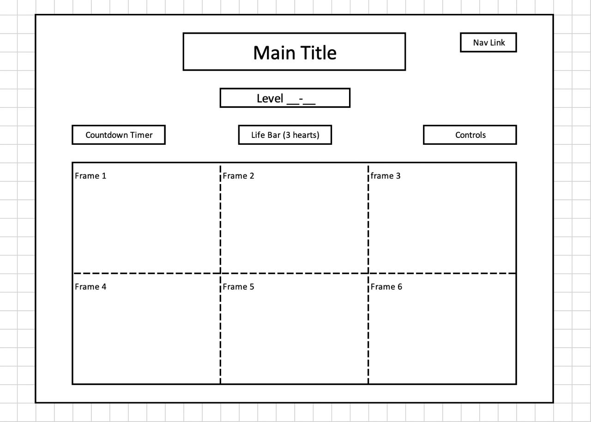

# **Background:**

Gary's Adventure is a 2D interactive puzzle game where Gary the snail is lost underwater. The main objective of the game is to help Gary get to home to Spongebob in Bikini Bottom. 

There are 6 frames in a 2x3 formation in every scene which can be moved around to help Gary get from the starting frame to the frame where the bubble is at. Each bubble leads to the next scene/level. Gary moves in one fixed direction until he hits an obstacle, where he will either lose a life (alien plant) or start moving in the opposite direction (rock). When Gary walks to a hole in the ground, he will either fall to the frame right below, or in the absence of a frame below, lose a life.

The game intends to introduce functionalities slowly to allow users to get the hang of it. There will be approximately 5-10 levels in this game.

 

# **Functionalities:**

In Gary's Adventure, user will be able to:
1. Swap the position of two frames by clicking consecutively on both frames. (When swapping Frames, Gary stops moving)
2. Locked frames cannot be moved to any other position.
3. Obstacles that cause the character to lose their lives will result in the level restarting.
4. A hole in the ground that will either make Gary fall to the frame right below, or in the absence of a frame below, lose a life.
5. Upon touching bubble, Gary floats away in it and next level starts
6. Upon reaching SPongebob's house (pineapple) in final level, Spongebob appears
5. A rule page will also be provided to the users

 

# **Wireframe:**

> - Nav links include links to this project's Github repo and my LinkedIn
> - In the Controls, there will be Game Sound on/off, Music on/off and Restart Level
> - There will be a Countdown Timer and a Life Bar

## **Instruction and Explanation will be the follow:** 
### Help Gary get back home! Swap the position of frames by clicking consecutively on two frames, while making use of, or avoiding some obstacles: 
> - Rock: Changes the direction that Gary is moving in.
> - Jellyfish: Zaps Gary (lose a life)
> - Hole in the Ground: Gary falls through the ground (either drops to the frame below; or loses a life if there are no frames below the hole) 

 

# **Technologies, Libraries, APIs**

This project will be implemented with the following technologies:
- The Canvas API to render the game board
- The Sprite to import the image
- Collisions Detect

 

# **Implementation Timeline**

- **Friday Afternoon & Weekend:** Setup project. Get canvas to show up on the screen, and spend time getting comfortable with the Canvas API. Create Board and one tile to test out. Create Gary and get him automaticlly moving one direction.

 

- **Monday:** If one tile and Gary works and Gary can automatically moving one direction and moving in oppsite direction when hitting a wall. Try to create another tile and making two tiles connect and make Gary move smoothly on them. Once done, create a obstactle and a goal to test out game over and collisions detect.

 

- **Tuesday:** Adding user interaction and swapping two tiles. Make sure Gary can move the same after swapping. Next, add a tile with a hole to make Gary fall to the tile right below if the tile is at the uppper level.

 

- **Wednesday:** Start styling the page. Adding those nav links and make the page looks better.

 

- **Thursday Morning:** Deploy to GitHub pages. If time, rewrite this proposal as a production README.